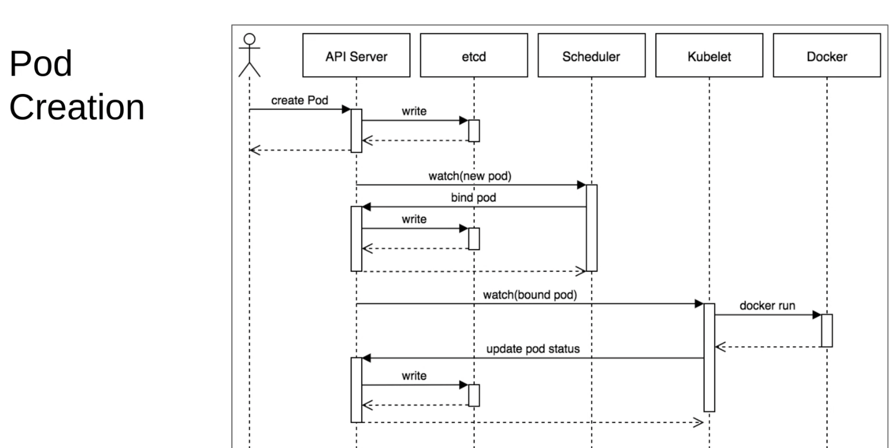

# Docker, Containers, Snyk and Kubernetes
<!-- TOC depthfrom:2 depthto:3 withlinks:true updateonsave:true orderedlist:false -->

- [Docker](#docker)
    - [Dockerfile](#dockerfile)
    - [Build](#build)
    - [Multi-Stage Builds](#multi-stage-builds)
    - [Run](#run)
    - [CMD, RUN and ENTRYPOINT](#cmd-run-and-entrypoint)
    - [Local credentials](#local-credentials)
    - [Docker Compose](#docker-compose)
    - [Image introspection](#image-introspection)
    - [Containers](#containers)
    - [Copy](#copy)
    - [Clean-up](#clean-up)
    - [Sidecar design pattern](#sidecar-design-pattern)
- [circleci](#circleci)
    - [Pass values from Docker Container to Host](#pass-values-from-docker-container-to-host)
    - [Set environment variable](#set-environment-variable)
    - [local setup](#local-setup)
    - [circleci setup](#circleci-setup)
    - [Validate config file](#validate-config-file)
    - [Speed](#speed)
    - [Define what branches you test on](#define-what-branches-you-test-on)
    - [On every config.yaml change](#on-every-configyaml-change)
    - [CircleCI and Docker Compose](#circleci-and-docker-compose)
    - [Share Docker Containers](#share-docker-containers)
    - [Resources](#resources)
- [distroless](#distroless)
- [Snyk](#snyk)
    - [Find local auth token](#find-local-auth-token)
    - [Container scan](#container-scan)
    - [Code scan](#code-scan)
    - [Dependency scan](#dependency-scan)
    - [custom filter results](#custom-filter-results)
    - [apply patches to your vulnerable dependencies](#apply-patches-to-your-vulnerable-dependencies)
    - [Test Javascript packages via CLI](#test-javascript-packages-via-cli)
    - [Monitor for new vulnerabilities](#monitor-for-new-vulnerabilities)
    - [Infrastructure as Code scanning](#infrastructure-as-code-scanning)
- [TwistLock](#twistlock)
- [Kubernetes](#kubernetes)
    - [Commands](#commands)
    - [Pod Creation](#pod-creation)
    - [Namespaces](#namespaces)
    - [can-i get](#can-i-get)
    - [API Server](#api-server)
    - [Secrets](#secrets)
    - [Logs](#logs)
    - [Delete](#delete)
    - [Drain and Cordon](#drain-and-cordon)
    - [Kubernetes auto complete](#kubernetes-auto-complete)
    - [Kubernetes for Docker Desktop](#kubernetes-for-docker-desktop)
    - [KubeVal](#kubeval)
    - [KubeSec](#kubesec)
- [Terraform](#terraform)
    - [Writing](#writing)

<!-- /TOC -->

## Docker

### Dockerfile

#### Pro tip - chown

```bash
# before
COPY install_zip.sh .
RUN chown -R myuser install_zip.sh

# after
COPY --chown=myuser install_zip.sh .
```

#### Pro tip - pip caching

`pip` keeps a copy of downloaded packages on disk.  Disable:

```bash
# No cache and pin version
RUN pip install --no-cache-dir poetry==${POETRY_VERSION}
```

#### lint

```bash
brew install hadolint
hadolint Dockerfile
```

#### Python - do I use a virtualenv?

<https://stackoverflow.com/questions/29146792/why-people-create-virtualenv-in-a-docker-container>

#### multiple RUN vs single chained RUN

[multiple-run-vs-single-chained-run](https://stackoverflow.com/questions/39223249/multiple-run-vs-single-chained-run-in-dockerfile-which-is-better):

>When possible, I always merge together commands that create files with commands that delete those same files into a single RUN line. This is because each RUN line adds a layer to the image, the output is quite literally the filesystem changes that you could view with docker diff on the temporary container it creates.

#### Order matters

For an efficient use of the caching mechanism, [reference](https://www.docker.com/blog/containerized-python-development-part-1/):
> place the instructions for layers that change frequently after the ones that incur less changes.

```python
# Changes less frequently
COPY requirements.txt .

# install dependencies
RUN pip install -r requirements.txt

# Changes often
COPY src/ .
```

#### Dockerfile design

<https://www.youtube.com/watch?v=15GYSxzdTLQ>

#### BuildKit

Reference: <https://pythonspeed.com/articles/docker-buildkit/>

### Build

#### Build options

```bash
# Build and name to present working directory
docker build -f Dockerfile -t $(pwd | xargs basename):latest .

# Pro, speed tip, if using multi-stage builds only build final image
 docker build -t $(pwd | xargs basename):latest . -t deploy

# multiple tags
docker build -t tiny-play:0.0.1 -t tiny-play:latest -f dockerfiles/Dockerfile_tiny .

# View progress in plaintext
docker build -f Dockerfile -t $(pwd | xargs basename):latest . --progress=plain

# Target a setp.  Debug a multi-stage build
docker build -f Dockerfile --target builder -t $(pwd | xargs basename):latest .

# docker-compose with BuildKit for Secrets
DOCKER_BUILDKIT=1 COMPOSE_DOCKER_CLI_BUILD=1 docker-compose -f docker-compose.yml 
build --build-arg build_secret=${BUILD_SECRET} --progress=plain --no-cache

## Build argument to env var in container
docker build -f Dockerfile --build-arg FOO_VERSION="$(./foo_echo_version_script)" -t $(pwd | xargs basename):latest .

  ## Dockerfile
  ARG FOO_VERSION
  ENV MY_FOO_VERSION ${FOO_VERSION}

# Stop secrets leaking in Docker History or an Image Layer
DOCKER_BUILDKIT=1 \
docker build -t $(pwd | xargs basename) \
  --secret id=build_secret,src=build_secret.txt \
  --progress=plain --no-cache \
  .

# build to stop container exiting
ENTRYPOINT ["tail", "-f", "/dev/null"]

```

### Multi-Stage Builds

- The Base Image can build, test and lint.  It might require a bunch of tools, libraries and package managers.
- The child image gets uploaded to a cloud environment.  It is small, quick and has the minimal privilege and extras.  Most engineers will use "scratch image", Alpine or something else when putting an app into AWS.

### Run

```bash
# interactive bash shell for container
docker run -it $(pwd | xargs basename):latest bash

# list files in /usr/bin
docker run -it --rm app:latest ls -l /usr/bin

# run Grafana. It will download if not locally stored
docker run -d --name=grafana -p 3000:3000 grafana/grafana

# Pass in .env file and var that can override the .env entries
docker run -e MYVAR1 --env MYVAR2=foo --env-file ./env.list $(pwd | xargs basename):latest bash

 # mount AWS directory as Read-Only for set AWS environment variables

docker run \
    --rm \
    --env AWS_PROFILE=foo \
    --env AWS_REGION=eu-west-3 \
    -v $HOME/.aws/:/root/.aws/:ro \
    -it $(pwd | xargs basename):latest \
    bash

# get file from Container to Host
  # inside Dockerfile: 
CMD ["./create_zip_file.sh"]
  # to get the zip file mount the dir/file to host 
docker run --rm -v /tmp/my_host:/tmp/my_container $(pwd | xargs basename):latest

# mount file. Better to pass in via Dockerfile but passing is as a command line argument works for some edge cases
docker run \
        --env TOKEN=${TOKEN} \
        -v $(pwd)/Dockerfile:/Dockerfile \
        -it ${REPONAME}:latest \
        bash

#### Interactive, terminal specify Bash
docker run -it ubuntu bash

#### Automatically remove container when it exits
docker run --rm -it ubuntu 

#### network connections ON THE HOST

docker run -it --net=container:${APISERVER_ID} controlplane/alpine-base

#### Automatically remove container when it exits after running a shell command
docker run \
  --rm \
  "${CIRCLE_PROJECT_REPONAME}:${CIRCLE_SHA1}" \
  /bin/bash -c '
    echo "Hello there"
  '

#### Name container for Docker Container ls
docker run --name foobar -it ubuntu

# Run service in background
docker pull swaggerapi/swagger-editor
docker run -d -p 7999:8080 swaggerapi/swagger-editor

# Interactive, detach and allocate Pseudo Terminal
docker run -idt ..

#### Run in privileged
docker run --privileged

# App Armor
docker run --rm -it --security-opt apparmor=docker-default duckll/ctf-box

# Start container
docker start ctf

# Stop container
docker stop ctf
```

### CMD, RUN and ENTRYPOINT

Nice article [here](https://goinbigdata.com/docker-run-vs-cmd-vs-entrypoint/):

#### RUN

install your application and packages required.

#### CMD

Set a default command. Executed only when you run container without specifying a command.

```Dockerfile
CMD echo "Hello world" 
```

```bash
docker run -it <image>
Hello world

docker run -it <image> /bin/bash
< no Hello world >
```

#### ENTRYPOINT

Command(s) not ignored when Docker container runs with command line parameters.

### Local credentials

#### Current docker.io logged in user

```bash
docker-credential-$(
  jq -r .credsStore ~/.docker/config.json
) list | jq -r '
  . |
    to_entries[] |
    select(
      .key | 
      contains("docker.io")         // modify here for other accounts
    ) |
    last(.value)
'
```

#### Contents of Credential Helper

```bash
docker-credential-desktop list | \
    jq -r 'to_entries[].key'   | \
    while read; do
        docker-credential-desktop get <<<"$REPLY";
    done
```

### Docker Compose

```bash
# status of containers
docker compose ps

# shotdown running containers
docker-compose down
docker-compose down --remove-orphans
docker compose -f docker-compose.ci.yml down --remove-orphans

# start
docker compose up  # start containers with debug output
docker compose up -d # run in detached mode [ no debug ouput ]

# Start both containers and run integration tests
docker compose -f docker-compose-test.yml up -d
docker compose -f docker-compose-test.yml up

# Verify you can access the Redis server
docker exec -it redis-server redis-cli

# Log into App Container with Go installed
docker exec -it app-test bash

# Access Redis server from the App Container
/app# redis-cli -u redis://${REDIS_URL}

# Run integration tests
docker exec -it app-test make test

# get env variables from webapp
docker compose run webapp env
docker compose run redis env

# scale Redis instances
$ docker-compose up --detach --scale redis-master=1 --scale redis-secondary=3

# lint
docker compose -f docker-compose.yml config
```

#### Integration tests

Things of note:

- The [wait-for](https://github.com/vishnubob/wait-for-it) bash script.  You load this into the container that is running the test.  This container should "wait" for Redis to be up and accepting connections.  Otherwise you get hard to diagnose errors.

- The "default" network manages the DNS of the Redis server.  In the below case it sets the Redis server value as `redis-server:6379`.

- When the tests are done, the "app-test" container will stop automatically.

- No `volumes` were mounted fo the `redis-server`.  Careful with docker-compose and `volumes`.  I mounted a file as a directory which took time to debug. The error:

```yaml
     volumes:
-      - $PWD/internal/config/redis.conf:/usr/local/etc/redis/redis.conf
-      - $PWD/internal/config/users.acl:/usr/local/etc/redis/users.acl
```

This caused this:

```shell
/usr/local/etc/redis # ls -l
total 8
# directories !
drwxr-xr-x    2 root     root          4096 Sep 26 09:32 redis.conf
drwxr-xr-x    2 root     root          4096 Sep 26 09:32 users.acl
```

I could have fixed it with `- $PWD/internal/config/:/usr/local/etc/redis/`.  But it was cleaner to create `Dockerfile_redis_test` and copy over the user `ACL file` and the `config file` during the Dockerfile.  This also kept the `docker-compose` file clean.

```yaml
version: "3.7"
services:
  redis-server:
    container_name: "redis-server"
    build:
      context: .
      dockerfile: Dockerfile_redis_test

  app-test:
    container_name: "app-test"
    environment:
      REDIS_URL:  $REDIS_URL
      REDIS_USER: $REDIS_USER
      REDIS_PSWD: $REDIS_PSWD
    build:
      context: .
      target: integration-tests
    depends_on:
      - redis-server
    entrypoint: [ "/app/wait-for.sh", $REDIS_URL, "--", "make", "test"]
```

To create the two containers and run the `make test`:

```bash
export REDIS_PSWD=bar \
	&& export REDIS_USER=foo \
	&& export REDIS_URL=redis-server:6379 \
	docker compose -f docker-compose-test.yml up 
```

#### Debugging docker-compose

```bash
# Great to check multiple containers on same network!
docker network inspect croof_default

# This found my error in the container redis-server!
docker logs --follow redis-server
1:C 26 Sep 2022 12:33:47.625 # Fatal error, can't open config file '/usr/local/etc/redis/redis.conf': No such file or directory

# check no cached image causing issue
docker compose down 
docker rmi -f $(docker images -a -q)
docker-compose up
```

### Image introspection

#### Skopeo

```bash
brew install skopeo

# inspect an image on Docker Hub
skopeo inspect docker://docker.io/fedora:latest --override-os linux

# inspect a specific tagged version
skopeo inspect docker://docker.io/foobar/foo:0.1.0

# inspect latest tag
skopeo inspect docker://docker.io/foobar/foo:latest

# Copy from Docker Hub
skopeo copy docker://docker.io/foobar/foo:latest dir:foobar

# Save from Docker Hub
skopeo copy docker://docker.io/foobar/foo:latest docker-archive:foo.tar

```

#### Search for secrets in layers

```bash
# Save Image for inspection
docker save foo:latest -o ~/foo.tar

# Extract the Docker layers
mkdir ~/foo && tar xf ~/foo.tar -C ~/foo | cd ~/foo

# Search each layer
for layer in */layer.tar; do tar -tf $layer | grep -w secret.file && echo $layer; done

# Or search for a specifc file
find . -name "*secret*"

# Extract where it found secret
tar xf FFFFFFFFF/layer.tar app/secret.file

# Print the secret
cat app/secret.file
```

#### Logs

```bash
# Keep container alive and echoing data
docker run -d busybox /bin/sh -c 'i=0; while true; do echo "$i: $(date)"; i=$((i+1)); sleep 1; done'

# Get container ID
docker ps
CONTAINER ID   IMAGE 
9a0c73bcf87d   busybox

# Get logs
docker logs 9a0c73bcf87d -f
```

#### Inspect

```bash
# Dive
brew install dive
dive docker://$(pwd | xargs basename)

# Image
docker image history alpine_non_root --no-trunc

# Tag
docker history foobar:v1 

# If built local folder into image
docker history $(pwd | xargs basename)

# Print layers
docker inspect --format='{{json .RootFS.Layers}}' foobar

# Inspect local image
docker image inspect $(pwd | xargs basename)

# Inspect Entrypoint

docker image inspect $(pwd | xargs basename):latest --format 'CMD: {{.Config.Cmd}} , ENTRYPOINT: {{.Config.Entrypoint}}
 
# Pretty Print
docker history --format "{{.ID}}: {{.CreatedSince}}" foo/bar:0.2.1

# Logs from Container ID
docker logs bd0657a17d54

# check if container is running as Privileged
docker inspect --format='{{.HostConfig.Privileged}}' <container id>

# Stats
docker stats < container ID >
```

#### Push to DockerHub

```bash
<Create Private repo on Dockerhub>
docker build -t rusty/flasksidecardemo .
sudo lsof -iTCP -sTCP:LISTEN -n -P 	# check no containers running on port
docker run -d -p 5000:5000 rusty/flasksidecardemo
docker push rusty/flasksidecardemo
```

### Containers

```bash
# Show Container IDs
docker ps

# Show Container IDs with memory footprint of the Thin R/W Layer
docker ps -s

# A history of images and container IDs
docker ps -a

# All exited container IDs
docker ps --all --filter STATUS=exited

# All running container IDs
docker ps --all --filter STATUS=running

# Run interactive Terminal with Cut and Paste
docker container exec -it ctf bash

# Stop by Container ID
docker stop <container id>

```

### Copy

#### from Host to Docker Container

`docker cp foo/bar.c bd0657a17d54://root/newbar.c`

#### check if image can mount disk on Host

`mount -t tmpfs none /mnt`

### Clean-up

```bash
# Remove all stopped containers
docker rm $(docker ps -a -q)

# Remove all all images not referenced by a container
docker image prune --all

# Removes images created more than 10 days (240h) ago
docker image prune -a --force --filter "until=240h"

# Container ( removed before Image removal )
docker container rm <container id>

# Remove Image
docker image rm <image id> --force

# Remove Image, force
docker rmi -f duckll/ctf-box
```

### Sidecar design pattern

There are [lots of design patterns](https://techbeacon.com/enterprise-it/7-container-design-patterns-you-need-know) with containers.  If containers only have "one responsibility", the `sidecar pattern` ensures you add common functionaly out of a container. This includes:

- Logging
- Monitoring
- TLS set up
- Strip / add Response Headers
- Configuration

Overview [here](https://containerjournal.com/topics/container-security/tightening-security-with-sidecar-proxies/):
> `Decoupling` of common tasks to an independent unified service deployed alongside any core application service is known as a “sidecar” architecture.  Primary application in Go.   Existing functionality written in Python to collect logs and metrics.  Offloading that Python code into a sidecar is more efficient than asking the development team to rewrite that functionality in Go.

#### Security references

- [NPM_TOKENS_LEAKING_IN_DOCKER](https://www.alexandraulsh.com/2018/06/25/docker-npmrc-security/)
- [CVE-2019-5736: runc container breakout](https://seclists.org/oss-sec/2019/q1/119)
- [Docker_Security_Cheat_Sheet](https://cheatsheetseries.owasp.org/cheatsheets/Docker_Security_Cheat_Sheet.html)

## circleci

### Pass values from Docker Container to Host

I struggled for hours with this.  I expected that `docker run -v /tmp:/data $(pwd | xargs basename):latest` would pass all files from `data` on the Container to the `tmp` folder of the Host.  That didn't happen.

The reason is referenced in the [tech documents](https://circleci.com/docs/2.0/building-docker-images/):

>It is not possible to mount a volume from your job space into a container in Remote Docker (and vice versa).

The answer is simpler:

```yaml
- run: |
    # start container with the application
    # make sure you're not using `--rm` option
    docker run --name app app-image:1.2.3

- run: |
    # after application container finishes, copy artifacts directly from it
    docker cp app:/output /path/in/your/job/space
```

### Set environment variable

You can set `Organization` or `Project` level environment variables.   Sometimes it is useful to override a `Organization` variable in a single `Circle CI Job`:

```yaml
jobs:
  build:
    environment:
      FOO: bar
```

[Reference](https://circleci.com/docs/2.0/configuration-reference/#modifiers).

### local setup

It was essential that you debug the `config.yml` file before uploading to circleci.

```bash
brew install --ignore-dependencies circleci

brew upgrade circleci 

circleci version
```

### circleci setup

Go to web interface for CircleCI. It can auto generate the files and workflow.

Then generate a `Personal Access Token` or `Project Access Token`.

```bash
circleci setup
```

Then check it all worked:

```bash
cat /Users/foobar/.circleci/cli.yml                               
host: https://circleci.com
token: .......66de
```

### Validate config file

```bash
circleci context
circleci config validate
circleci config validate .circleci/config.yml
```

### Speed

Don't chain `requires` unless required:

```yaml
workflows:
  my_workflow:
    jobs:
      - prod_image
      - test_image
      - push_code:
          requires:
          - prod_image
      - scan_with_some_tool:
          requires:
          - test_image
```

### Define what branches you test on

```yaml
filter_deployable: &filter_deployable
  filters:
    branches:
      only:
        - sandbox
        - master
workflows:
  my_workflow:
    jobs:
    ...
    ...
      - scan_with_some_tool:
            <<: *filter_deployable
            requires:
            - test_image
```

### On every config.yaml change

```bash
circleci config validate
circleci config process .circleci/config.yml > process.yml
circleci local execute -c process.yml --job build

# Environment variable
circleci local execute \
 -c process.yml \
 --job build \
 --env FOO_TOKEN=${FOO_TOKEN}
```

### CircleCI and Docker Compose

```yaml
      - run:
          name: Start all services declared in docker-compose.yml
          command: docker-compose up -d
```

### Share Docker Containers

### Resources

<https://circleci.com/developer/orbs/orb/circleci/python>

<https://circleci.com/docs/2.0/local-cli/#run-a-job-in-a-container-on-your-machine>

<https://circleci.com/docs/2.0/ssh-access-jobs/>

## distroless

```shell
# why
https://docs.aws.amazon.com/AmazonECS/latest/bestpracticesguide/security-tasks-containers.html

# scratch vs distroless
https://iximiuz.com/en/posts/containers-distroless-images/

# distroless with shell + root + BusyBox ( echo, cat, sleep )
docker run -it --rm --name base -u 0 gcr.io/distroless/base:debug

# works on Debug distroless ( as BusyBox present ) but not non-debug
docker run -it --rm app:latest sleep 5

# inspect distroless
dive gcr.io/distroless/static

# normal distroless image fails as no echo installed
docker run -it --rm  foo echo "hello world"
docker run -it --rm foo sleep 1  

# put app in /usr/bin/ and this works
docker run -it foo app version

# Builder image can also only contain application ( and no shell )
docker run -it --rm "cgr.dev/chainguard/go":latest version
< prints go version >

# for statically compile Go apps CGO_ENABLED=0
gcr.io/distroless/static

# when app is not statically compiled and requires C libraries CGO_ENABLED=1
gcr.io/distroless/base
```

## Snyk

```bash
brew install npm
npm install -g snyk
npm i snyk

# Upgrade
npm i -g snyk

# Verify it works
snyk auth
```

### Find local auth token

```bash
export SNYK_TOKEN=$(jq -r '.api' ~/.config/configstore/snyk.json)

echo ${SNYK_TOKEN}   
ffffffff-eeee-dddd-cccc-4fd7923c9cc8

cat ~/.config/configstore/snyk.json 
{
        "api": "ffffffff-eeee-dddd-cccc-dddddddddddd",
        "org": "foobar"
}% 
```

### Container scan

```bash
snyk container test busybox
snyk test --docker alpine --file=Dockerfile --exclude-base-image-vulns
snyk container test $(basename $(pwd)) --file=Dockerfile
snyk test --docker alpine --file=Dockerfile --exclude-base-image-vulns
snyk container monitor --docker $(basename $(pwd)):latest --file=Dockerfile --debug
snyk test --severity-threshold=critical --docker alpine --file=Dockerfile --json > ~/results.json
```

### Code scan

```bash
snyk config set org=playground
snyk code test
snyk code test --sarif
snyk code test --severity-threshold=high
```

### Dependency scan

```bash
# Python and poetry
snyk test --file=poetry.lock --package-manager=poetry

# pip and Python3
pip install -r requirements.txt

# Scala or Java - you need one of these tools installed!
sbt "-Dsbt.log.noformat=true" dependencyTree
sbt "-Dsbt.log.noformat=true" coursierDependencyTree

# Scala single file
snyk monitor --severity-threshold=high --file=api-integration-util/build.sbt

https://docs.snyk.io/features/snyk-cli/test-for-vulnerabilities/scan-all-unmanaged-jar-files

https://docs.snyk.io/products/snyk-open-source/language-and-package-manager-support/snyk-for-java-gradle-maven

# install SBT Dependency Graph https://support.snyk.io/hc/en-us/articles/360004167317
echo "addSbtPlugin(\"net.virtual-void\" % \"sbt-dependency-graph\" % \"0.10.0-RC1\")" > plugins.sbt

snyk monitor --severity-threshold=high

# force Snyk to consider Python3
snyk test --file=requirements.txt --package-manager=pip --command=python3

# Send Snapshot to Snyk
snyk monitor --severity-threshold=high --file=requirements.txt --package-manager=pip --command=python3 
```

### custom filter results

```bash
git clone https://github.com/snyk-tech-services/snyk-filter.git
npm install -g
source ~/.zshrc
snyk test --json | snyk-filter -f ~/path/to/snyk-filter/sample-filters/example-cvss-9-or-above.yml    
```

### apply patches to your vulnerable dependencies

`snyk protect`

### Test Javascript packages via CLI

Snyk reads `package.json` and `package-lock.json` files, to build a full structured [Javascript](https://support.snyk.io/hc/en-us/articles/360004712477-Snyk-for-JavaScript) dependency tree.

```bash
cd codeDir
yarn install       // or 'npm install'
snyk test --severity-threshold="high" --json > snyk.json
```

### Monitor for new vulnerabilities

`snyk monitor`

### Infrastructure as Code scanning

```shell
# snyk
// individual files
snyk iac test Kubernetes.yaml
snyk iac test terraform_file.tf
// folder and sub-folders
snyk iac test
snyk iac test | grep '✗'
snyk iac test --severity-threshold=high
snyk iac test --severity-threshold=high --json > results.json

# tfsec
brew install tfsec
tfsec .

# bridgecrew
bridgecrew -d apps/foo --bc-api-key ${BC_TOKEN} --framework terraform
bridgecrew --show-config
bridgecrew -d apps/foo --bc-api-key ${BC_TOKEN} --framework terraform --repo-id foo/bar
```

## TwistLock

```bash

# Get twistcli from installed PrismaCloud
curl \     
  -u ${TWISTLOCK_USER} \
  -o results \                                       
  "${TWISTLOCK_PATH_TO_CONSOLE}/api/v1/util/twistcli"

# Scan assuming TWISTLOCK_USER and TWISTLOCK_PASSWORD env variables are set
twistcli images \
 scan $(pwd | xargs basename)

# Scan
twistcli images scan \
  --address ${TWISTCLI_PATH_TO_CONSOLE} \
  --user ${TWISTLOCK_USER} \
  --password ${TWISTLOCK_PASSWORD} \
 $(pwd | xargs basename)

# Scan with details
twistcli images scan $(pwd | xargs basename) --details

# Check all is ok
curl -k \
-H "Authorization: Bearer ${TWISTLOCK_PASSWORD}" \
-X POST ${TWISTCLI_PATH_TO_CONSOLE}/api/v1/authenticate
  
# install
curl --progress-bar -L -k --header "authorization: Bearer API-TOKEN" https://kubernetes:30443/api/v1/util/twistcli > /usr/local/bin/twistcli

chmod a+x /usr/local/bin/twistcli

# twistcli does not pull images for you.
twistcli images scan \                        
  --address ${TWISTCLI_PATH_TO_CONSOLE} \
  --user ${TWISTLOCK_USER} \
  --password ${TWISTLOCK_PASSWORD} \
  --details \
  $(pwd | xargs basename):latest
  
# get scan report
twistcli images scan \
  --address ${TWISTCLI_PATH_TO_CONSOLE} \
  --user ${TWISTLOCK_USER} \
  --password ${TWISTLOCK_PASSWORD} \
  myimage:latest

# detailed report
twistcli images scan \
  --address ${TWISTCLI_PATH_TO_CONSOLE} \
  --user ${TWISTLOCK_USER} \
  --password ${TWISTLOCK_PASSWORD} \
  --details \
  myimage:latest

# scan
/usr/local/bin/twistcli defender export kubernetes \
        --address https://kubernetes:30443 \
        --user ${USERNAME} \
        --password ${PASSWORD} \
        --cluster-address twistlock-console \
        --output defender.yaml
```

## Kubernetes

### Commands

- <https://kubernetes.io/docs/reference/generated/kubectl/kubectl-commands>
- <https://kubernetes.io/docs/reference/kubectl/cheatsheet/>

```bash
# version
kubectl version
kubectl version -o json

# view config
kubectl config view
kubectl config view
kubectl config view -o jsonpath='{.users[].name}' 

# Deploy
kubectl apply -f deploy.yml

# Describe deployment
kubectl describe po hello-deployment

# Deploy status
kubectl rollout status deployment/hello-deployment

# Get deployments
kubectl get deployments

# create Pod named "secret" with yaml file
kubectl apply -f secret-pod.yml

# create Pod manually
kubectl run mypod --image=controlplane/secrets-demo:1.0

# get env variables from mypod
kubectl exec -it mypod -- env

#  Find which node your pod is running on
kubectl describe pods my_pod

# get pods regardless of namespace
kubectl get pods --all-namespaces --output wide

# get pods
kubectl get pods
kubectl get pods -A -o=custom-columns='DATA:spec.containers[*].image'
kubectl get pods --namespace default --output=custom-columns="NAME:.metadata.name,IMAGE:.spec.containers[*].image"

# get Pod registry info
kubectl describe pod privateer-1 | grep -i image

# get IP addresses
kubectl get pods -o wide

# debug
watch kubectl get pods -o wide

# Get services
kubectl get services

# Get a service
kubectl get svc hello-svc

# Get ReplicaSets
kubectl get rs

# Scale
kubectl scale -n default deployment hello-deployment --replicas=3

```

### Pod Creation



### Namespaces

Logically group applications, environments, teams, etc.

```bash
kubectl get namespaces
kubectl get pods --all-namespaces
kubectl create namespace foobar
kubectl run nginx --image=nginx --namespace=foobar
kubectl get all --namespace=foobar
kubectl delete namespace foobar
```

### can-i get

```bash
# verb, resource, and optional resourceName
kubectl auth can-i get rs

# verb, resource, and optional resourceName
kubectl auth can-i --list
```

### API Server

```bash
# API image
APISERVER_IMAGE=$(docker ps | awk '/k8s_kube-apiserver/{print $2}')
echo "${APISERVER_IMAGE}"

# API server connections
sudo lsof -Pan -i tcp | grep 6443

# API server info
ps faux | sed -E 's,.*(kube-apiserver.*),\1,g;t;d' | grep -v 'g;t;d' | tr ' ' '\n'

# Kill API server and watch restart
sudo kill -9 "$(ps faux | grep kube-apiserver | head -1 | awk '{print $2}')"
sleep 1
docker ps | grep k8s_kube-apiserver
```

### Secrets

```bash
# create secrets from files
kubectl create secret generic user-pass --from-file=./username.txt --from-file=./password.txt

# create secrets from env vars
kubectl create secret docker-registry regcred --docker-server=https://index.docker.io/v2/ --docker-username=${NAME} --docker-password=${PSWD} --docker-email=${EMAIL}

# get secret info ( not the secret )
kubectl get secrets

# get secret as B64 encoded
kubectl get secret user-pass -o yaml

# get secret info
kubectl get secret regcred --output="jsonpath={.data.\.dockerconfigjson}" | base64 --decode

# meta data about secret
kubectl describe secret user-pass

# check for issues
kubectl logs secret

```

### Logs

```bash
# logs of a single container
WEAVE_POD=$(kubectl get --namespace kube-system pods -l name=weave-net -o json | jq -r '.items[0].metadata.name')
kubectl logs --namespace kube-system $WEAVE_POD --container weave

# etcd - "system of record".  Distributed consensus.   Highly available.
kubectl logs -f -n kube-system etcd-kubernetes-master

# Follow - real-time container log output
kubectl logs --namespace kube-system $WEAVE_POD --container weave --follow

# Cluster events
kubectl get events --sort-by=.metadata.creationTimestamp | tail -n 20

# Info about Kubelet daemon
systemctl status kubelet.service
```

### Delete

```bash
# delete all
kubectl delete all --all    
# delete Pod in Namespace "kube-system"
kubectl delete pod --namespace kube-system $KUBE_PROXY
kubectl delete -f deploy.yml
kubectl delete -n default deployment hello-deployment
kubectl delete replicaset demo-api
kubectl delete service demo-api
kubectl delete pod busybox-curl
kubectl delete namespace my-namespace
```

### Drain and Cordon

```bash
# Drain node in preparation for maintenance
kubectl drain kubernetes-worker-0 --ignore-daemonsets

# Mark node as schedulable
kubectl uncordon kubernetes-worker-0

# Mark node as unschedulable
kubectl cordon kubernetes-worker-0
```

### Kubernetes auto complete

```bash
source <(kubectl completion zsh)  
echo "[[ $commands[kubectl] ]] && source <(kubectl completion zsh)" >> ~/.zshrc # add autocomplete permanently to your zsh shell
```

### Kubernetes for Docker Desktop

Great [tutorial](https://andrewlock.net/running-kubernetes-and-the-dashboard-with-docker-desktop/):

```bash
# check Kubernetes is "enabled" inside of `Docker Desktop
kubectl config get-contexts
kubectl config use-context docker-desktop
kubectl get nodes

# Dashboard
kubectl edit deployment kubernetes-dashboard -n kubernetes-dashboard

# Install
kubectl apply -f https://raw.githubusercontent.com/kubernetes/dashboard/v2.2.0/aio/deploy/recommended.yaml

# Disabling the login prompt in Kubernetes Dashboard
kubectl patch deployment kubernetes-dashboard -n kubernetes-dashboard --type 'json' -p '[{"op": "add", "path": "/spec/template/spec/containers/0/args/-", "value": "--enable-skip-login"}]'

# Delete
kubectl delete -f https://raw.githubusercontent.com/kubernetes/dashboard/v2.2.0/aio/deploy/recommended.yaml
```

### KubeVal

```bash
brew tap instrumenta/instrumenta
brew install kubeval
kubeval deploy.yml
```

#### Raft

[Overview](https://runway.systems/?model=github.com/ongardie/runway-model-raft#)

### KubeSec

<https://kubesec.io/>

#### Kube-score

`docker run -v $(pwd):/project zegl/kube-score:v1.10.0 score deploy.yml`

## Terraform

### Writing

Writing [AWS Terraform files](https://blog.gruntwork.io/an-introduction-to-terraform-f17df9c6d180) introduction:

```shell

#upgrade
brew upgrade hashicorp/tap/terraform

#version
terraform --version

# auto complete
terraform -install-autocomplete

# reads the current settings from all managed remote objects and updates the Terraform state to match.
terraform refresh

terraform init
terraform console
terraform plan
terraform apply
terraform output
terraform output public_ip

# Validate
terraform init -backend=false
terraform validate

# Debug variables
TFLOG=debug
terraform refresh
terraform show 
terraform show -json | jq .

# Remove inconsistent state ( when AWS and TF differ )
terraform state rm -state=sandbox.tfstate module.apps.baz.foo_params
```

#### APIs

```bash
# Gets List of strings
value = local.country_codes

# Convert from List of Strings to Map
value = { for idx, val in local.foobar_domains : idx => val }

# Get List of String values if
value = [for x in local.foobar_domains : x if x == "foobar.fr"]

# get index
value = index(local.foobar_domains, "foobar.fr")

# Contains Boolean response
contains(local.foobar_domains, "foobar.fr")

# Lookup
> lookup({a=["bob", "Alice"], b=["Alice"], c=[]}, "a", "what?")
[
  "bob",
  "Alice",
]
> lookup({a=["bob", "Alice"], b=["Alice"], c=[]}, "c", "what?")
[]
> lookup({a=["bob", "Alice"], b=["Alice"], c=[]}, "d", "what?")
"what?"


```

#### Check installed versions

```bash
brew list --formulae |
xargs brew info --json |
jq -r '
    ["name", "latest", "installed version(s)"],
    (.[] | [ .name, .versions.stable, (.installed[] | .version) ])
    | @tsv
'
```

#### tflint

```bash
# Lint ( macOS )
brew install tflint

#which tflint               
/usr/local/bin/tflint

# Set Cloud environment ( so lint rules work )
# Copy in plug-in data from https://github.com/terraform-linters/tflint-ruleset-aws
vi ~/.tflint.hcl

# Init the lint
tflint --init

# file lint
tflint foobar_file.tf

# Behind the scenes
tflint -c ~/.tflint.hcl foobar.tf 

# Set log level
tflint --loglevel trace foobar.tf

# Debug
TFLINT_LOG=debug tflint
```
